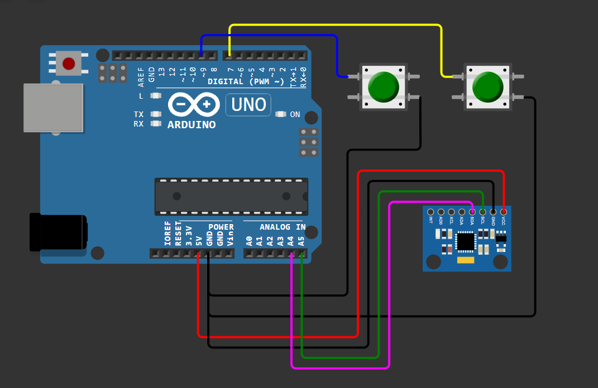

# Gesture Controlled Mouse

An interactive system that allows a user to control the computer cursor using hand gestures, interfaced via an ESP32/Arduino and a Python bridge.

## 🚀 How it Works
1. **Hardware:** The sensors detect movement and send data to the microcontroller, push button switches are used to get the right and left click
2. **Communication:** Data is sent via Serial communication to a PC.
3. **Software:** A Python script parses the data and moves the system cursor.

## 🛠️ Tech Stack
* **Language:** C++ (Arduino), Python
* **Hardware:** ESP32, MPU6050, Push button switches
* **Python Libraries:** `pySerial`, `pyautogui`

## 📂 Project Structure
* `source/`: Contains the firmware and Python scripts.
* `assets/`: Contains circuit diagrams and block diagrams.

## 📂 Repository Structure

text
├── assets/                  # High-resolution block diagrams and circuit schematics
├── source/                  # Core project codebase
│   ├── Mouse_final.ino      # Hardware firmware logic and coordinate polling
│   └── mouse.py            # Python background utility for OS cursor injection
└── README.md                # System documentation and setup guide

## 🚀 Setup & Installation

### 1. Hardware Initialization
1. Connect the **MPU6050** and **Push Buttons** to the ESP32 according to the schematic in the `assets/` directory.
2. Open `source/Mouse_final.ino` in the Arduino IDE.
3. Ensure you have the necessary MPU6050 libraries installed.
4. Select the **ESP32 Dev Module** (or your specific board) and the correct COM port.
5. Compile and upload the firmware.

### 2. Software Configuration
1. Navigate to the `source/` directory on your PC.
2. Install the Python dependencies:
   ```bash
   pip install pyserial pyautogui

## 🛠️ Hardware Design

To visualize the connection between the MPU6050 sensor, the tactile switches, and the microcontroller, refer to the simulation diagram below:



### Pin Mapping
| Component | Pin (ESP32/Uno) | Function |
| :--- | :--- | :--- |
| **MPU6050 SDA** | A4 / GPIO 21 | I2C Data |
| **MPU6050 SCL** | A5 / GPIO 22 | I2C Clock |
| **Left Click Button** | Digital 9 | Mouse Left Click |
| **Right Click Button** | Digital 7 | Mouse Right Click |
